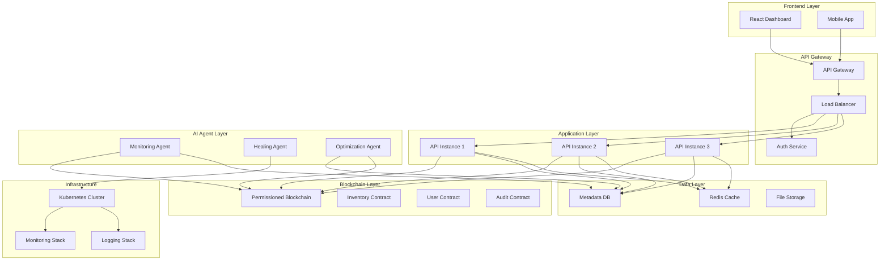
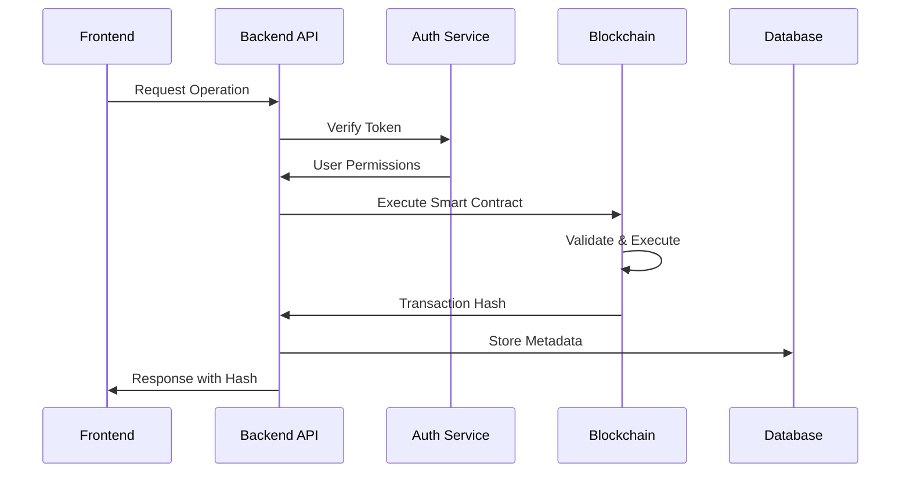
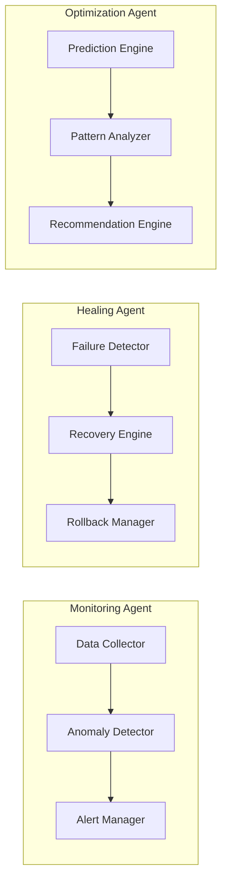
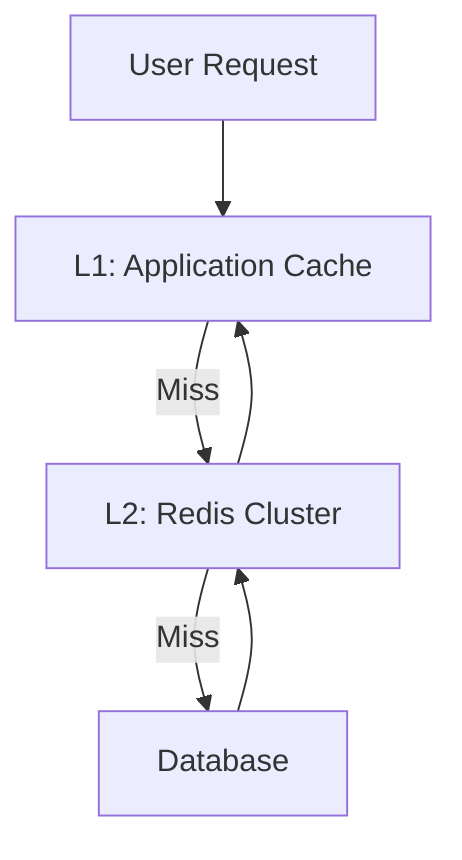
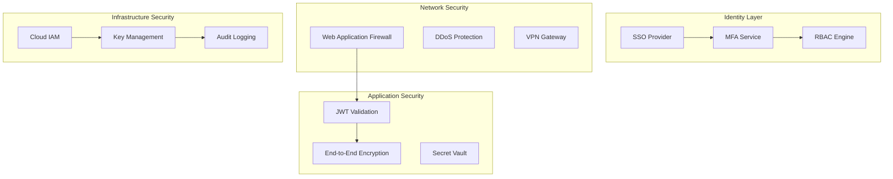
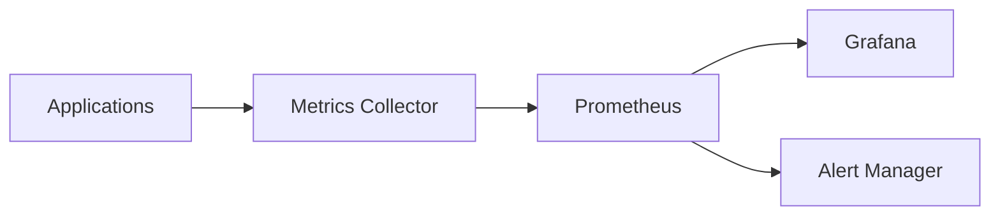
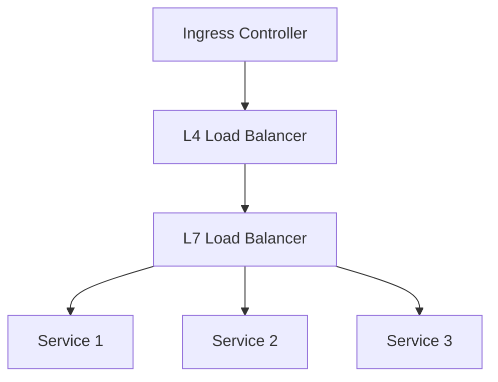

# System Architecture

## Overview

The Enterprise Blockchain Inventory Management System is designed as a distributed, fault-tolerant architecture that combines the immutability of blockchain with the flexibility of modern cloud infrastructure and the intelligence of AI agents.

## 🏗️ High-Level Architecture



## 🔗 Blockchain Architecture

### Smart Contract Design

The system uses a modular smart contract architecture:

1. **InventoryManager Contract**
   - Core inventory operations
   - Item creation, updates, transfers
   - Permission validation

2. **UserRegistry Contract**
   - User management and roles
   - Authentication verification
   - Access control enforcement

3. **AuditLogger Contract**
   - Immutable audit trail
   - Event logging
   - Compliance tracking

### Transaction Flow



## 🤖 AI Agent Architecture

### Agent System Design

The AI agents operate as independent microservices with the following architecture:



### Agent Communication

- **Event Bus**: Redis pub/sub for real-time communication
- **State Store**: Shared state via etcd
- **Health Checks**: Regular health reporting
- **Failover**: Automatic leader election

## 🗄️ Data Architecture

### Database Schema Design

#### PostgreSQL (Off-chain Data)

```sql
-- Users and Authentication
users (id, email, role, wallet_address, created_at, updated_at)
user_sessions (id, user_id, token, expires_at, created_at)

-- Inventory Metadata
inventory_items (id, sku, name, description, category, blockchain_hash)
inventory_locations (id, item_id, location_id, quantity, last_updated)
locations (id, name, address, manager_id)

-- Audit Logs
audit_logs (id, user_id, action, resource, blockchain_tx, timestamp)
system_events (id, event_type, severity, description, metadata)
```

#### MongoDB (Document Storage)

- Product specifications
- Image binaries
- File attachments
- Configuration documents

### Caching Strategy



## 🔐 Security Architecture

### Zero-Trust Model



## 📡 API Architecture

### RESTful API Design

```
/api/v1/
├── auth/
│   ├── login
│   ├── logout
│   ├── refresh
│   └── register (admin only)
├── users/
│   ├── / (list users)
│   ├── /:id (user details)
│   ├── /:id/roles (manage roles)
│   └── /me (current user)
├── inventory/
│   ├── / (list items)
│   ├── /:id (item details)
│   ├── /:id/history (item history)
│   ├── /:id/transfer (transfer item)
│   └── /:id/update (update quantity)
├── locations/
│   ├── / (list locations)
│   ├── /:id (location details)
│   └── /:id/inventory (items at location)
├── audit/
│   ├── / (audit logs)
│   ├── /users/:id (user activity)
│   └── /items/:id (item history)
└── admin/
    ├── /system/health
    ├── /system/metrics
    └── /ai/status
```

### GraphQL Alternative

```graphql
type Query {
  inventoryItems(filter: InventoryFilter): [InventoryItem!]!
  users(role: Role): [User!]!
  auditLogs(filter: AuditFilter): [AuditLog!]!
}

type Mutation {
  createInventoryItem(input: CreateItemInput!): InventoryItem!
  transferInventory(input: TransferInput!): TransferResult!
  updateUserRole(userId: ID!, role: Role!): User!
}
```

## 🚀 Deployment Architecture

### Kubernetes Infrastructure

```yaml
# Deployment Strategy
apiVersion: apps/v1
kind: Deployment
metadata:
  name: inventory-api
spec:
  replicas: 3
  strategy:
    type: RollingUpdate
    rollingUpdate:
      maxSurge: 1
      maxUnavailable: 0
```

### Service Mesh

- **Istio** for service-to-service communication
- **mTLS** for encrypted inter-service traffic
- **Traffic management** with canary deployments
- **Observability** with distributed tracing

## 📊 Monitoring & Observability

### Metrics Collection



### Logging Architecture

- **Structured Logging**: JSON format with correlation IDs
- **Log Aggregation**: ELK Stack (Elasticsearch, Logstash, Kibana)
- **Log Retention**: Hot/warm/cold tier storage
- **Log Security**: Encryption and access controls

## 🔧 Configuration Management

### Environment Strategy

```bash
# Development
.env.development
├── Database (local PostgreSQL)
├── Blockchain (Ganache)
└── AI Agents (local)

# Staging
.env.staging
├── Database (cloud PostgreSQL)
├── Blockchain (testnet)
└── AI Agents (staging cluster)

# Production
.env.production
├── Database (managed PostgreSQL)
├── Blockchain (mainnet)
└── AI Agents (production cluster)
```

## 📈 Performance Considerations

### Scalability Design

- **Horizontal Scaling**: Stateless API services
- **Database Sharding**: Geographic distribution
- **Caching Layers**: Multi-level caching strategy
- **Blockchain Optimization**: Batch transactions, gas optimization

### Load Balancing



---

This architecture ensures the system is secure, scalable, resilient, and capable of handling enterprise-scale inventory management operations while maintaining the integrity and auditability provided by blockchain technology.